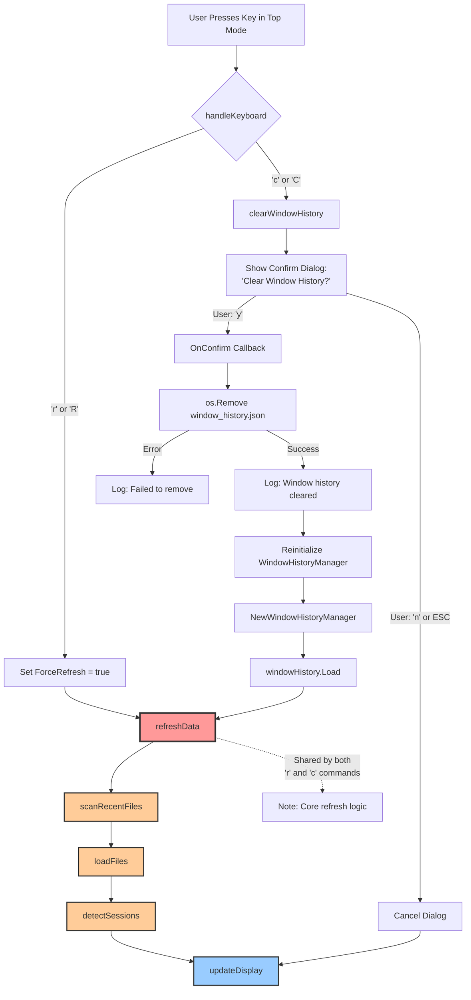

# Keyboard Commands Workflow

This document illustrates the workflow for keyboard commands in the `go-claude-monitor top` command, specifically focusing on the 'c' (clear window history) and 'r' (refresh data) commands.

## Overview

Both commands are handled in the `handleKeyboard` method in `internal/core/session/manager.go`. While they have different entry points and purposes, they share common functionality through the `refreshData()` method.

## Workflow Diagram

## Key Components

### Command Handlers

#### 'r' Command (Refresh)
- **Purpose**: Force an immediate data refresh
- **Code Location**: `manager.go:499-502`
- **Workflow**:
  1. Sets `ForceRefresh` flag to true
  2. Calls `refreshData()` directly
  3. No user confirmation required

#### 'c' Command (Clear Window History)
- **Purpose**: Clear all learned session window boundaries
- **Code Location**: `manager.go:503-505`
- **Workflow**:
  1. Calls `clearWindowHistory()`
  2. Shows confirmation dialog
  3. If confirmed:
     - Removes `~/.go-claude-monitor/history/window_history.json`
     - Reinitializes WindowHistoryManager
     - Calls `refreshData()` to reload with fresh detection
  4. If cancelled: closes dialog without changes

### Shared Functions

Both commands ultimately use these shared functions:

1. **`refreshData()`** (`manager.go:552-562`)
   - Rescans recent JSONL files
   - Loads and parses files
   - Detects active sessions

2. **`scanRecentFiles()`**
   - Finds JSONL files modified within 6 hours
   - Ensures complete 5-hour session capture

3. **`loadFiles()`**
   - Batch validates cache
   - Loads from cache or parses new files
   - Updates memory cache

4. **`detectSessions()`**
   - Loads historical limit windows
   - Detects active sessions
   - Calculates metrics

5. **`updateDisplay()`**
   - Applies sorting
   - Renders the terminal display

## Design Benefits

1. **Code Reuse**: Both commands share the core refresh logic
2. **Consistency**: Same data loading process ensures consistent results
3. **Efficiency**: Cache validation and batch processing
4. **User Safety**: Destructive operations (clear) require confirmation

## Related Files

- `internal/core/session/manager.go` - Main command handling
- `internal/core/session/window_history.go` - Window history management
- `internal/core/session/keyboard.go` - Keyboard input handling
- `internal/core/session/memory_cache.go` - Memory caching layer